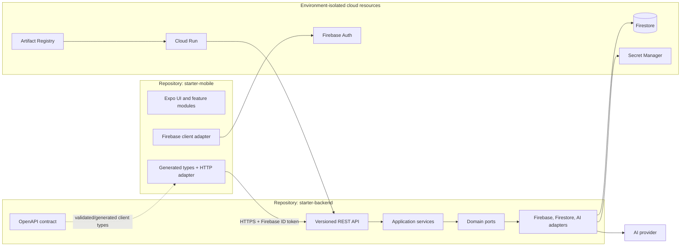

# Architecture Overview

## Goal

Create two small, secure templates that let a team validate a new product idea quickly without cloning product-specific Docsera behavior. The templates standardize the expensive, repetitive foundation—identity, API access, persistence, AI integration, observability, and delivery—while leaving the product domain deliberately empty.

## Repository boundaries



The mobile app depends on the published API contract, not on backend source. The backend accepts any conforming client, not only the starter mobile app.

## Core versus product code

| Reusable starter core | Product-specific extension |
|---|---|
| Auth verification and current-user provisioning | Roles, onboarding rules, organizations |
| Standard errors and correlation IDs | Domain errors and business policies |
| Repository and provider ports | Product entities and external integrations |
| Minimal stateless AI request | Prompts, tools, RAG, conversation memory |
| Environment validation and health checks | Product configuration and feature flags |
| CI, promotion, rollback, and release metadata | Product release cadence |
| Expo auth gate and HTTP client | Branding, navigation, screens, analytics |

The starter should not include Docsera's documents, OCR, storage, billing, subscriptions, or search. Those remain useful reference implementations.

## Backend architecture

Use a pragmatic ports-and-adapters structure:

```text
api -> application -> domain
             |          ^
             v          |
            ports <- adapters
```

- `domain/` is plain Java and contains business concepts only.
- `application/` implements use cases and authorization decisions.
- `ports/` defines capabilities required from infrastructure.
- `adapters/` implements Firebase, Firestore, AI, and other providers.
- `api/` maps HTTP input/output and never contains business rules.
- `config/`, `security/`, `logging/`, and `health/` are platform concerns.

Cloud portability is achieved at meaningful seams. The template does not abstract Spring itself or create an interface for every class.

## Mobile architecture

Keep the mobile application thin but feature-oriented:

```text
app routes -> feature hooks/components -> ports -> adapters
                                      -> TanStack Query cache
```

- `app/` owns Expo Router composition and route-level UI.
- `src/features/` owns feature behavior and view models.
- `src/ports/` defines auth and API capabilities used by features.
- `src/adapters/` owns Firebase and HTTP details.
- Server data stays in TanStack Query; transient UI state stays local.

Do not reproduce backend authorization or business rules in the app. Client checks improve UX; server checks provide security.

## Integration contract

The backend publishes the v1 OpenAPI document and serves versioned routes under `/api/v1` (implemented in roadmap Phase 2):

| Method | Path | Purpose |
|---|---|---|
| `GET` | `/health/live` | Process liveness; no dependency details |
| `GET` | `/health/ready` | Readiness for deployment smoke tests |
| `GET` | `/api/v1/me` | Authenticated current user |
| `POST` | `/api/v1/ai/chat` | Minimal authenticated, stateless AI request |

All errors use one schema containing `code`, `message`, and `correlationId`. The backend validates the OpenAPI file in CI (`OpenApiContractTest` keeps the committed `openapi/openapi.yaml` and the implementation in sync); the mobile repository pins a copy of the contract and validates it in CI (`npm run validate:contract`).

## Environment model

| Environment | Backend | Mobile | External data |
|---|---|---|---|
| `local` | Explicit mocks/emulators only | Local Expo development | Disposable |
| `dev-local` | Local process using DEV services | Optional local app against DEV API | Shared DEV |
| `dev` | Cloud Run in `{app}-dev` | Preview/internal build | Shared DEV |
| `prod` | Cloud Run in `{app}-prod` | Store-signed build | Production |

There is no implicit fallback from a cloud environment to `local`. A missing profile or required variable must stop startup or build.

## Security and privacy baseline

- Verify Firebase ID tokens for every protected request and derive user ownership from the verified principal.
- Store server secrets only in Secret Manager and use Workload Identity Federation from GitHub Actions.
- Use least-privilege service accounts per environment.
- Rate-limit and budget AI calls per authenticated user before provider invocation.
- Never log tokens, prompts, model responses, passwords, or sensitive domain payloads by default.
- Restrict production CORS to actual web origins. Native apps do not need permissive CORS.
- Keep only a minimal public liveness response; do not expose build or environment detail publicly.
- Make production deployment approval-controlled and rollbackable.

## Delivery model

Backend:

```text
PR -> verify -> merge -> build image once -> deploy digest to DEV
                                      -> approved deploy of same digest to PROD
```

Mobile:

```text
PR -> lint/typecheck/test
merge -> DEV preview build (not store-promotable)
release tag -> store build -> TestFlight/Play internal -> release same store binary
```

See the backend and mobile CI/CD documents for executable workflow requirements.

## Deliberate non-goals for template v1

- Microservices or Kubernetes
- A generic workflow engine
- Multi-tenant organizations or admin portals
- File storage, OCR, subscriptions, vector search, or RAG
- Offline-first synchronization
- Provider-specific AI features in domain code
- Automatic propagation of starter changes into created product repositories
