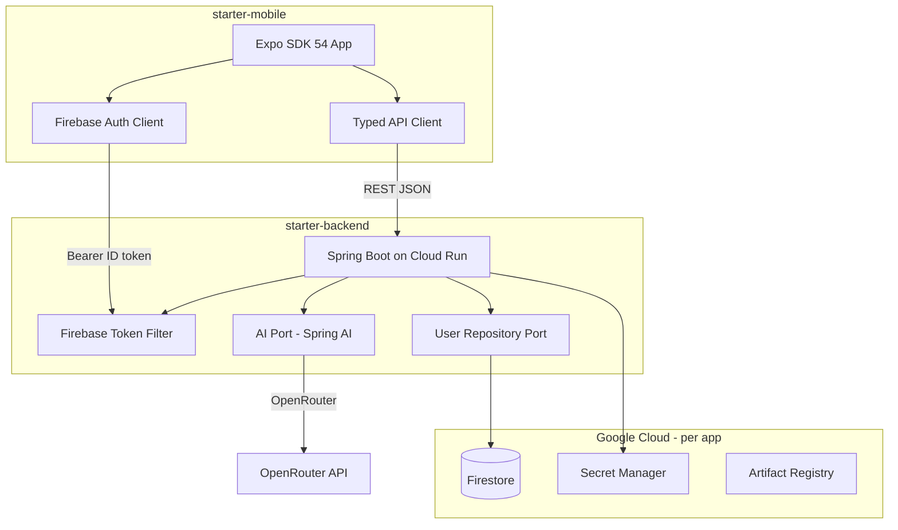

# Architecture Overview

High-level design for the starter kit: a reusable backend + mobile foundation that you fork and customize per product.

## System diagram



## Repository layout

```text
starter/                    # Monorepo (single git repository)
├── docs/                   # Cross-cutting guides
├── starter-backend/        # Spring Boot API package
└── starter-mobile/         # Expo mobile package
```

When you create a new product, **fork or copy this entire monorepo** and rename placeholders (`starter` → `{app}`) across all packages.

## Architectural principles

### 1. Portable by design (ports and adapters)

Cloud services and third-party APIs are hidden behind interfaces. The starter uses:

- **Backend:** hexagonal layout (`api` → `application` → `domain` ← `ports` ← `adapters`)
- **Mobile:** thin client with `ports/` and `adapters/` for Firebase and HTTP

This lets you swap Firestore for PostgreSQL, OpenRouter for another provider, or Firebase for another auth system without rewriting business logic.

### 2. Scale-to-zero (serverless first)

- **Backend:** Google Cloud Run (no always-on VMs or Kubernetes during MVP)
- **Database:** Firestore (serverless, pay-per-use)
- **Secrets:** GCP Secret Manager

Avoid fixed-cost infrastructure until product-market fit is clear.

### 3. Thin client, backend is source of truth

The mobile app never treats local state as authoritative for:

- User identity (Firebase provides tokens; backend provisions the user record)
- AI responses (all inference runs server-side)
- Business rules (enforce on the API, not only in the client)

### 4. Security by default

- Every protected API call requires a valid Firebase ID token
- No cloud service account keys on the mobile device
- Secrets only in Secret Manager / CI secrets — never in YAML or git
- Actuator admin endpoints protected with HTTP Basic auth

### 5. Simple MVP first

The starter intentionally includes only:

| Endpoint | Purpose |
|----------|---------|
| `GET /actuator/health` | Liveness for Cloud Run and mobile reachability check |
| `GET /api/me` | Authenticated user profile (auto-provisioned in Firestore) |
| `POST /api/chat` | Minimal AI integration (Spring AI + OpenRouter) |

Extensions (file upload, subscriptions, search, workers) are documented separately and added per product.

## What is shared vs per-app

| Concern | Shared (starter pattern) | Per-app (you customize) |
|---------|--------------------------|-------------------------|
| Hexagonal package layout | Yes | Rename `com.starter` → `com.{app}` |
| Spring profiles (`local`, `dev-local`, `dev`, `prod`) | Yes | — |
| CI/CD flow (main → DEV, manual → PROD) | Yes | GitHub repo + GCP project names |
| Firebase Auth + token filter | Yes | Firebase project per env |
| Firestore user collection | Yes | Additional collections per domain |
| Spring AI + OpenRouter | Yes | Prompts, models, rate limits |
| Expo + expo-router structure | Yes | Screens, branding, bundle ID |
| GCP projects | Pattern: `{app}-dev`, `{app}-prod` | Your project IDs |
| Domain logic | Skeleton only | `application/` + `src/features/` |

## Environment model

### Backend profiles

| Profile | Where it runs | GCP | Firebase |
|---------|---------------|-----|----------|
| `local` | Developer machine | Mocks / emulators | Auth emulator |
| `dev-local` | Developer machine (IntelliJ) | Real DEV project | Emulator or real |
| `dev` | Cloud Run DEV | `{app}-dev` | DEV Firebase |
| `prod` | Cloud Run PROD | `{app}-prod` | PROD Firebase |

### Mobile environments

| `APP_ENV` | API target | Firebase project | Distribution |
|-----------|------------|------------------|--------------|
| `development` | DEV Cloud Run URL | DEV | EAS internal / TestFlight internal |
| `production` | PROD Cloud Run URL | PROD | App Store / Play Store |

See [ENVIRONMENT_MATRIX.md](./ENVIRONMENT_MATRIX.md) for the full variable mapping.

## Deployment flow

```text
Developer
  → feature branch
  → PR + review
  → merge to main
      → backend: GitHub Actions → Docker → Artifact Registry → Cloud Run DEV
      → mobile: GitHub Actions → EAS Build DEV (internal)
  → test against DEV
  → manual workflow
      → backend: deploy same image tag to Cloud Run PROD
      → mobile: EAS Submit same build ID to store tracks
```

**Build once, promote the same artifact** — do not rebuild for PROD unless DEV failed and was fixed.

## Extension paths (not in starter MVP)

Add these when your product needs them. Each has a doc stub in starter-backend:

| Extension | Backend doc | Typical trigger |
|-----------|-------------|-----------------|
| File upload (signed GCS URLs) | `docs/STORAGE_EXTENSION.md` | User-generated content |
| Subscriptions (RevenueCat) | Architecture § Future extensions | Paid plans |
| Async workers (Cloud Tasks) | Architecture § Future extensions | Background processing |
| Search / RAG | Architecture § Future extensions | Document Q&A products |

## Related docs

- [NEW_APP_WORKFLOW.md](./NEW_APP_WORKFLOW.md) — fork and configure a new product
- [starter-backend/docs/backend_architecture_plan.md](../starter-backend/docs/backend_architecture_plan.md) — backend detail
- [starter-mobile/docs/mobile_architecture_plan.md](../starter-mobile/docs/mobile_architecture_plan.md) — mobile detail
