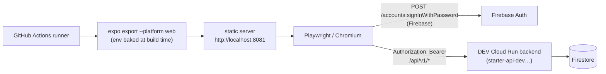

# Browser E2E Integration Plan — Mobile app × DEV backend

**Status: planned 2026-08-23 — NOT yet implemented.** Integrate when ready; work top-to-bottom.
Companion to [`STEP5_FIRST_PUSH_CHECKLIST.md`](./STEP5_FIRST_PUSH_CHECKLIST.md) (§5 CI path is
green; this adds the automated-E2E layer on top of it).

## Goal

Prove, on every PR, that the real UI drives the real stack: **login → `me` → sign-out** against
the live DEV Cloud Run backend through a headless browser. Optional gated spec extends this to
the AI chat round-trip.

What it proves: Expo Router renders on web, FirebaseAuthAdapter works end-to-end, ID-token
requests hit the pinned v1 contract, protected routes gate correctly.
What it does **not** prove: native runtime behavior (gestures, AsyncStorage, push) — that stays
with Jest unit tests now, Maestro-on-Android later if wanted.

## Why this is low-risk here (verified 2026-08-23)

| Fact | Evidence |
|---|---|
| App uses Firebase **JS SDK**, which runs natively in browsers | `firebase@^12.7.0` in `package.json` |
| The auth adapter **already branches for web** (browser persistence) | `src/adapters/FirebaseAuthAdapter.ts:25` (`Platform.OS === 'web'` → plain `getAuth`) |
| DEV backend CORS **already allows** the origin we need | `deploy-dev.yml:161` — `STARTER_CORS_ALLOWED_ORIGINS=http://localhost:8081,…` |
| Routes exist for the full flow | `app/(auth)/login.tsx`, `app/(tabs)/index.tsx`, `app/(tabs)/chat.tsx` |

→ **Zero backend changes required** as long as the exported site is served on `http://localhost:8081`.



## Decisions to confirm at integration time

1. **Gate PRs?** Recommended yes (`on: pull_request` + dispatch). Adds ~3–5 min per PR.
2. **AI chat spec in or out?** Each run spends OpenRouter fractions of a cent. Recommended:
   include, but `workflow_dispatch`-only (not per-PR).
3. **Test account policy:** one shared `smoke-test@…` user (same one specced for the backend's
   optional authenticated smoke). Fine for a template; revisit if tests ever run concurrently.

<details><summary><strong>Firebase test user</strong> (click-path — same as backend smoke)</summary>

```
1. console.firebase.google.com → project starter-local-b9525 (DEV)
   → Build → Authentication → Sign-in method → Email/Password must be enabled.
2. Authentication → Users → Add user, e.g. smoke-test@starter-demo-dev.com + strong password.
3. GitHub repo secret on patrikbego/starter-mobile (Settings → Secrets and variables → Actions):
   - FIREBASE_TEST_USER_EMAIL = that address
   - FIREBASE_TEST_USER_PASSWORD = that password
   (Same secret names the backend's authenticated smoke expects — one pair serves both.)
4. The user exists only so CI can log in; it owns no special data.
```
</details>

## Work breakdown

### P0 — Spike: does the app really run on web? (risk gate, ~1 h)

```bash
cd starter-mobile && set -a; . ./.env; set +a
export API_BASE_URL_DEV=https://starter-api-dev-906316354955.europe-west2.run.app
npx expo export --platform web
npx serve dist -l 8081     # MUST be 8081 — see CORS note above
```

Open `http://localhost:8081`, log in with any real DEV Firebase user, visit tabs, sign out.
If anything crashes here (web-incompatible dependency), stop and reassess — everything below
assumes this works.

### P1 — Playwright scaffold + first spec (~half day)

- devDeps: `@playwright/test` (+ `npx playwright install chromium`)
- `e2e/` directory at repo root, **outside** Jest's roots so suites stay independent
- `playwright.config.ts`: `baseURL: http://localhost:8081`; `webServer` boots the static server
  against `dist/`; retries 1 in CI; trace+screenshot+video retained on failure
- First spec `e2e/auth.spec.ts`: open `/` → redirected to login → sign in with test user →
  expect `me` data visible → sign out → back on login
- npm scripts: `"test:e2e": "playwright test"`, `"test:e2e:headed"`, plus export helper
- Gates stay green: `npm run lint`, `npx tsc --noEmit`, `jest`, `validate:contract`

### P2 — Secrets (dropdown above)

Set `FIREBASE_TEST_USER_EMAIL` / `FIREBASE_TEST_USER_PASSWORD` as GitHub **secrets**
(password is a credential — never a variable).

### P3 — CI workflow `.github/workflows/web-e2e.yml`

```text
on: pull_request + workflow_dispatch
steps: checkout → setup-node (.nvmrc, npm cache) → npm ci
       → export web (env: EXPO_PUBLIC_FIREBASE_*, API_BASE_URL_DEV=https://starter-api-dev….run.app)
       → npx playwright install --with-deps chromium
       → npx playwright test        # env from secrets
       → upload-artifact on failure (trace/screenshots/video)
```

Notes:

- Export-time env comes from repo **variables** (already exist: `EXPO_PUBLIC_FIREBASE_*`,
  `API_BASE_URL_DEV`) — `${{ vars.* }}`, same pattern as `build-preview.yml`.
- Login credentials come from repo **secrets** via process env into the Playwright process.
- Keep total job under ~10 min; static export + Chromium is fast.

### P4 — AI chat spec (optional, dispatch-only)

`e2e/ai.spec.ts`: logged in → send exactly **one** message → assert a non-empty reply renders.
Runs only on `workflow_dispatch` (separate job in the same workflow, `if: github.event_name ==
'workflow_dispatch'`). Spend ≈ fraction of a cent per manual run; rate limit on the backend
(`AI_MAX_REQUESTS_PER_USER=120/window`) is the safety net.

### P5 — Housekeeping

- Sonar: add `e2e/**` to `sonar.exclusions` in `sonar-project.properties` so new coverage/dup
  metrics don't regress (mobile gate is new_coverage 87.1).
- Tick a box in `STEP5_FIRST_PUSH_CHECKLIST.md` §6-ish / record the workflow link once green.
- Later tier (out of scope here): Maestro against the EAS-built APK on an emulator — proves the
  *native* runtime; iOS sim in CI skipped deliberately (macOS runners cost paid minutes).

## Environment matrix

| Variable | Scope | Source |
|---|---|---|
| `EXPO_PUBLIC_FIREBASE_API_KEY/_AUTH_DOMAIN/_PROJECT_ID` | export step (build-time) | repo variables (`vars.*`, already set) |
| `API_BASE_URL_DEV` | export step (baked into bundle) | repo variable (already set) |
| `FIREBASE_TEST_USER_EMAIL/_PASSWORD` | Playwright runtime | repo **secrets** (new, P2) |
| Serve port | static server | fixed `8081` — matches backend CORS allow-list |

## Risks & mitigations

| Risk | Mitigation |
|---|---|
| A dependency breaks web export despite the adapter being web-ready | P0 spike gates everything; if blocked, fall back to Maestro-on-Android as the first tier instead |
| Flaky UI tests erode trust | retry 1×, traces on failure, keep specs to flow-level assertions (no pixel/snapshot brittleness) |
| OpenRouter spend creep | AI spec dispatch-only, one message per run |
| Port drift breaks CORS silently | pin 8081 in config + comment linking `deploy-dev.yml:161`; if the origin ever changes, update BOTH sides |
| Concurrent runs share one Firebase user | acceptable for template scale; serialize via `concurrency` group if it ever bites |

## Definition of done

- [ ] P0 manual web login against DEV works locally
- [ ] `npm run test:e2e` green locally against served export
- [ ] `web-e2e.yml` green on a PR and via dispatch; failure artifacts downloadable
- [ ] AI spec (if kept) green on dispatch
- [ ] Sonar mobile gate still OK after `sonar.exclusions` change
- [ ] Checklist doc updated with the new workflow link
