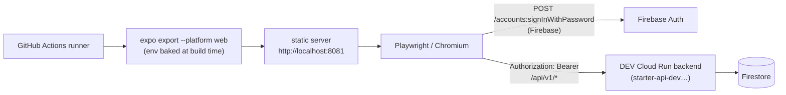

# Browser E2E Integration Plan — Mobile app × DEV backend

**Status: P0–P4 implemented 2026-08-23.** Playwright suite green locally and in CI
(`web-e2e` PR gate 2m42s + `web-e2e-ai` dispatch job, both success); AI spec dispatch-only.
Work top-to-bottom; decisions below are resolved.
Companion to [`STEP5_FIRST_PUSH_CHECKLIST.md`](./STEP5_FIRST_PUSH_CHECKLIST.md) (§5 CI path is
green; this adds the automated-E2E layer on top of it).

## Goal

Prove, on every PR, that the real UI drives the real stack: **register → `me` → sign-out →
login → `me` → sign-out** against the live DEV Cloud Run backend through a headless browser.
The suite registers its own fresh user each run (Decision 3), so nothing must exist beforehand.
Optional gated spec extends this to the AI chat round-trip.

What it proves: Expo Router renders on web, FirebaseAuthAdapter works end-to-end, ID-token
requests hit the pinned v1 contract, protected routes gate correctly.
What it does **not** prove: native runtime behavior (gestures, AsyncStorage, push) — that stays
with Jest unit tests now, Maestro-on-Android later if wanted.

## Why this is low-risk here (verified 2026-08-23)

| Fact | Evidence |
|---|---|
| App uses Firebase **JS SDK**, which runs natively in browsers | `firebase@^12.7.0` in `package.json` |
| The auth adapter **already branches for web** (browser persistence) | `src/adapters/FirebaseAuthAdapter.ts:25` (`Platform.OS === 'web'` → plain `getAuth`) |
| DEV backend CORS **already allows** the origin we need | `deploy-dev.yml:161` — `STARTER_CORS_ALLOWED_ORIGINS=http://localhost:8081,…` |
| Routes exist for the full flow | `app/(auth)/login.tsx`, `app/(tabs)/index.tsx`, `app/(tabs)/chat.tsx` |

→ **Zero backend changes required** as long as the exported site is served on `http://localhost:8081`.



## Decisions to confirm at integration time

1. **Gate PRs?** Recommended yes (`on: pull_request` + dispatch). Adds ~3–5 min per PR.
2. **AI chat spec in or out?** Each run spends OpenRouter fractions of a cent. Recommended:
   include, but `workflow_dispatch`-only (not per-PR).
3. **Test account policy (updated 2026-08-23):** the suite **registers its own user** every run —
   `e2e-smoke+<run-id>@starter-demo-dev.com` (Firebase treats each full address as distinct, so
   re-runs never collide). No pre-created user, no credential secret. Users accumulate in DEV
   Firebase Auth — harmless at template scale.

<details><summary><strong>DEV prerequisites</strong> (was: manual test user — now self-registration)</summary>

```
✅ Both prerequisites true since 2026-08-23:
1. Email/Password enabled in starter-demo-dev (Firebase added to the GCP project that hosts
   the backend, web app `starter-mobile-dev` registered) — token audiences now match by
   construction. History: mobile `.env` pointed at local-only project `starter-local-b9525`;
   the mismatch 401'd every authenticated call until P0 caught it.
2. Password policy stays at default (min 6 chars) or matches what the spec generates.
The old shared smoke-test@… user and FIREBASE_TEST_USER_* secrets are no longer needed by the
web E2E; that pair remains relevant only to the backend's own authenticated smoke.
```
</details>

## Work breakdown

### P0 — Spike: does the app really run on web? (risk gate, ~1 h)

```bash
cd starter-mobile && set -a; . ./.env; set +a
export API_BASE_URL_DEV=https://starter-api-dev-906316354955.europe-west2.run.app
npx expo export --platform web
npx serve dist -l 8081     # MUST be 8081 — see CORS note above
```

Open `http://localhost:8081`, tap **Need an account? Sign up**, register a fresh user (any
address + ≥6-char password), confirm `me` renders, sign out, log back in with the same
credentials, sign out again. If anything crashes here (web-incompatible dependency), stop and
reassess — everything below assumes this works.

### P1 — Playwright scaffold + first spec (~half day)

- devDeps: `@playwright/test` (+ `npx playwright install chromium`)
- `e2e/` directory at repo root, **outside** Jest's roots so suites stay independent
- `playwright.config.ts`: `baseURL: http://localhost:8081`; `webServer` boots the static server
  against `dist/`; retries 1 in CI; trace+screenshot+video retained on failure
- First spec `e2e/auth.spec.ts`: open `/` → redirected to login → switch to **Sign up** →
  register fresh `e2e-smoke+<run-id>@…` user → expect `me` data visible → sign out → sign
  **in** with same credentials → `me` visible again → sign out → back on login
- npm scripts: `"test:e2e": "playwright test"`, `"test:e2e:headed"`, plus export helper
- Gates stay green: `npm run lint`, `npx tsc --noEmit`, `jest`, `validate:contract`

### P2 — Secrets (dropdown above)

**Superseded 2026-08-23:** the suite registers its own user, so web-E2E needs **no** credential
secrets. Revisit only if a fixed user ever comes back (a password would be a secret, never a
variable).

### P3 — CI workflow `.github/workflows/web-e2e.yml`

```text
on: pull_request + workflow_dispatch
steps: checkout → setup-node (.nvmrc, npm cache) → npm ci
       → export web (env: EXPO_PUBLIC_FIREBASE_*, API_BASE_URL_DEV=https://starter-api-dev….run.app)
       → npx playwright install --with-deps chromium
       → npx playwright test        # no credential env needed (self-registration)
       → upload-artifact on failure (trace/screenshots/video)
```

Notes:

- Export-time env comes from repo **variables** (already exist: `EXPO_PUBLIC_FIREBASE_*`,
  `API_BASE_URL_DEV`) — `${{ vars.* }}`, same pattern as `build-preview.yml`.
- No credentials are injected: the auth spec registers its own user at runtime (Decision 3).
- Keep total job under ~10 min; static export + Chromium is fast.

### P4 — AI chat spec (optional, dispatch-only) ✅ implemented 2026-08-23

`e2e/ai.spec.ts`: logged in → send exactly **one** message → assert a non-empty reply renders.
Runs only on `workflow_dispatch` (separate `web-e2e-ai` job in the same workflow,
`if: github.event_name == 'workflow_dispatch'`; PR gate never spends money). Spend ≈ fraction
of a cent per manual run; rate limit on the backend
(`AI_MAX_REQUESTS_PER_USER=120/window`) is the safety net. Implementation notes: Playwright
projects split by regex (`chromium` excludes, `chromium-ai` matches with retries 0);
`testID`s added to chat bubbles for deterministic reply selection.

### P5 — Housekeeping

- Sonar: add `e2e/**` to `sonar.exclusions` in `sonar-project.properties` so new coverage/dup
  metrics don't regress (mobile gate is new_coverage 87.1).
- Tick a box in `STEP5_FIRST_PUSH_CHECKLIST.md` §6-ish / record the workflow link once green.
- Later tier (out of scope here): Maestro against the EAS-built APK on an emulator — proves the
  *native* runtime; iOS sim in CI skipped deliberately (macOS runners cost paid minutes).

## Environment matrix

| Variable | Scope | Source |
|---|---|---|
| `EXPO_PUBLIC_FIREBASE_API_KEY/_AUTH_DOMAIN/_PROJECT_ID` | export step (build-time) | repo variables (`vars.*`, already set) |
| `API_BASE_URL_DEV` | export step (baked into bundle) | repo variable (already set) |
| Test credentials | none needed | suite self-registers `e2e-smoke+<run-id>@…` (Decision 3) |
| Serve port | static server | fixed `8081` — matches backend CORS allow-list |

## Risks & mitigations

| Risk | Mitigation |
|---|---|
| A dependency breaks web export despite the adapter being web-ready | P0 spike gates everything; if blocked, fall back to Maestro-on-Android as the first tier instead |
| Flaky UI tests erode trust | retry 1×, traces on failure, keep specs to flow-level assertions (no pixel/snapshot brittleness) |
| OpenRouter spend creep | AI spec dispatch-only, one message per run |
| Port drift breaks CORS silently | pin 8081 in config + comment linking `deploy-dev.yml:161`; if the origin ever changes, update BOTH sides |
| Per-run registrations accumulate in DEV Firebase Auth | harmless at template scale; prune manually, or add teardown delete via Admin SDK later |
| Sign-up left as default entry point could let CI runs fail on `email-already-in-use` if run-id collisions were ever introduced | run-id includes timestamp + run number; see Decision 3 |

## Definition of done

- [x] P0 manual web **register + login** against DEV works locally
- [x] `npm run test:e2e` green locally against served export (2 specs, ~17s incl. fresh export)
- [x] `web-e2e.yml` green on a PR and via dispatch (2026-08-23, first runs: PR check 2m42s,
      dispatch success — starter-mobile PR #17). Failure artifacts upload on `failure()` only.
- [x] AI spec green on dispatch (2026-08-23; runs only via `workflow_dispatch`, one message/run)
- [ ] Sonar mobile gate still OK after `sonar.exclusions` change *(no sonar-project.properties
      exists in starter-mobile yet — becomes actionable when Sonar is actually wired up)*
- [x] Checklist doc updated with the new workflow link (STEP5 §5, mobile bring-up section)

Two integration notes encoded in the scaffold (2026-08-23): `expo export` does not auto-load
`.env` (hence `scripts/export-web.mjs`), and RN Web renders `Pressable` without a button role
(specs select by exact text, not ARIA role).
