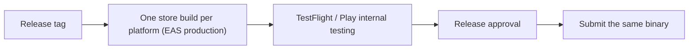

# Step 5 — Delivery and Recovery (Phase 5 of the roadmap)

Status of this guide: **workflow side implemented and verified** (gated DEV deploy, digest-only PROD promotion, smoke/alerts, release metadata, rollback runbooks). Live execution per app (pushed repos, GCP projects, EAS credentials) is the remaining external step. See the per-workstream status blocks below.

Phase 5 goal (from [`docs/IMPLEMENTATION_ROADMAP.md`](../docs/IMPLEMENTATION_ROADMAP.md)):

> The team can promote and recover without rebuilding or guessing.

Everything in Phase 5 exists to close this loop for the backend:

```mermaid
flowchart LR
  PR["Pull request"] --> Verify["mvn verify + contract + scans"]
  Verify --> Merge["Merge to main"]
  Merge --> DevJob["deploy-dev (gated on CI)"]
  DevJob --> Digest["Build once → push sha256 digest"]
  Digest --> Dev["Deploy digest to DEV"]
  Dev --> Smoke["DEV smoke + capture release metadata"]
  Smoke --> Approval["Protected production env + approval"]
  Approval --> Promo["promote-prod (no build step)"]
  Promo --> Prod["Deploy same digest to PROD"]
  Prod --> ProdSmoke["PROD smoke + failure reporting"]
```

…and, separately, a mobile release path:

## Template-for-many-apps (decided)

This is a **starter**, not a one-off. We copy it to create many apps; CI/CD must work for every one of them. Decisions locked in:

| Question | Decision | Consequence |
|---|---|---|
| How apps are created | **Clone with history** — each app repo is created by cloning `starter-backend`/`starter-mobile` (origin = app, `upstream` = template); *Use this template* is not used (it strips history and breaks upstream merges) | The copied repo inherits working CI/CD; template improvements flow back in via `git merge upstream/main` (see `docs/UPSTREAM_SYNC.md`) |
| Sonar | **One shared SonarQube server**; every app registers as its own project key on the same instance | Run analysis locally in Docker before push (Step 5); CI Sonar is a deferred, per-app follow-up — no per-app server to host |
| Delivery model | **Each app repo is self-contained** — backend deploy + Sonar + smoke live inside the app's own repo | Scales by copying; no cross-repo orchestration to maintain |
| Local gate | **Standard** — lint + typecheck + tests + Sonar + container build run locally in Docker before push | CI mainly re-confirms; deploy/smoke is the only new work in CI |

What every app must set (the “per-app identifiers”) when it is created from the template:

- SonarQube project key (e.g. `<app>-backend`, `<app>-mobile`) + a per-repo secret for the Sonar token.
- Backend cloud naming already parameterized by `{app}`: Cloud Run service `{app}-api-{env}`, Firestore, Artifact Registry repo — Terraform `infra/*.tfvars` per env.
- Mobile PROD config: Firebase project id, `applicationId`/bundle id, API URL — guarded by `app.config.ts` validation.
- CI will fail closed if these are left at template values, so a fresh copy must rename them before it can deploy.

## Prerequisites

Before any of these steps, the Phase 1 tail must be done (it gates everything):

- [ ] Backend and mobile repos pushed to GitHub (`main`) and **marked as template repositories**.
- [ ] Repository settings enabled: branch protection, Dependabot, secret scanning/push protection.
- [ ] All GitHub secrets/environments created (OIDC/WIF, `ACTUATOR_PASSWORD`, `OPENAI_API_KEY`, `EXPO_TOKEN`, store credentials).
- [ ] Backend `infra/` applied for DEV so Cloud Run services, Firestore, registry, and WIF exist (Phase 3).
- [x] A shared SonarQube server is reachable and has a project-creation workflow that a copied app can follow (see Workstream C) — **local server up** (`http://localhost:9000`); scans run locally, so no hosted URL/CI secrets yet

## Workstream C — Shared quality gate and app creation (enables the rest)

Because apps are created by copying the template, do this once, up front, so every copied app can run Sonar the same way.

### C1. Stand up the shared SonarQube server

> Status: **implemented locally.** Server files live in [`shared-infra/sonar/`](../shared-infra/sonar/) — `docker-compose.yml` (SonarQube 26.8.0.126808-community + Postgres 17, pinned), `.env.example`, and the bootstrap [`README.md`](../shared-infra/sonar/README.md). Local instance verified: containers healthy, `/api/system/status` = `UP`, defaults valid.

- [x] Run SonarQube in Docker for local analysis (single server instance; apps connect to it by project key) — running at `http://localhost:9000`
- [x] Decide the hosted target (cloud VM / existing infra) so CI and developers point at the same server; record the URL and the admin bootstrap — **decision recorded: Sonar scans run locally during Step 5** (server at `localhost`, token/URL exported in the shell profile); no GitHub secrets or hosted URL yet. Revisit when an app enables Sonar in CI
- [x] Define the per-app **project key convention** (e.g. `<app>-backend`, `<app>-mobile`) and the analysis properties that every template copy will use (`sonar.projectKey`, `sonar.projectName`, source/test paths) — convention + backend (Maven) and mobile (sonar-scanner) commands documented in `shared-infra/sonar/README.md`

**Acceptance:** ✓ **proven on the real template backend** — `starter-backend` scanned (56 files preprocessed, 43 tests, quality gate `OK`, dashboard `/dashboard?id=starter-backend`). A fresh copied app repeats the same command with its own key (C3). **Caveat:** coverage reports 0% until JaCoCo is added to the backend build (see `shared-infra/sonar/README.md`).

### C2. Bake the local gate into the template

> Status: **implemented and proven.** `scripts/local-gate.sh` added to `starter-backend` and `starter-mobile`, documented in both READMEs, and both scans verified against the local server.

- [x] Document the standard pre-push local gate for the backend (`./mvnw verify`, Sonar analysis, `docker build`) and the mobile (`npm ci`, `validate:contract`, lint, `tsc --noEmit`, tests, Sonar analysis) — captured in `scripts/local-gate.sh` + README in each template repo
- [x] Keep Sonar local-only for now (decision): CI re-confirms lint/typecheck/tests/build but does **not** run Sonar. If an app later enables Sonar in CI, reuse the same commands and add per-repo `SONAR_TOKEN`/`SONAR_HOST_URL` secrets pointing at a hosted server
- [x] (Deferred with local-only Sonar) Capture per-app Sonar token as a repository secret — not needed until CI Sonar is enabled

**Acceptance:** ✓ **proven end-to-end** — `starter-backend` now reports **70.2% coverage** (JaCoCo added; 44 tests green) and `starter-mobile` analyzed (1320 ncloc) on the shared server; both gate scripts run the documented local flow. **Caveats:** mobile coverage shows 0% until a Jest lcov report is wired to `sonar.javascript.lcov.reportPaths`; CI Sonar remains a deferred per-app follow-up.

### C3. Verify the create-an-app loop with a disposable trial app

- [ ] Derive a throwaway app from `starter-backend` and `starter-mobile` by cloning with history (`docs/UPSTREAM_SYNC.md` §5).
- [ ] Rename the per-app identifiers, run the local Docker gate, push, and confirm CI + shared-Sonar + DEV deploy work in the copied repo.
- [ ] Record setup time and every manual exception; fix the template until the process is repeatable (this is the Phase 6 trial, run once to validate the scaffolding now).

**Acceptance:** a copied app reaches a working DEV environment with static analysis through the shared Sonar server, using only the documented path.

## Workstream A — Backend delivery (immutable, gated)

### A1. Gate DEV deployment on the same CI job/workflow

> Status: **implemented** in `starter-backend/.github/workflows/`. `actionlint` passes; end-to-end execution still needs the repo pushed (CI runs on GitHub).

- [x] Make `deploy-dev.yml` depend on a reusable verification workflow — extracted a shared [`verify.yml`](../starter-backend/.github/workflows/verify.yml) (`mvn clean verify` + SBOM upload) called by both `ci.yml` and the `verify` job gating `deploy-dev.yml`; a failing build/tests/contract/SBOM blocks every downstream job
- [x] Add a DEV concurrency group with cancellation (`concurrency.group: deploy-dev`, `cancel-in-progress: true`) — an older queued deploy cannot replace a newer one
- [x] Define the job chain explicitly: `verify → build-and-push → deploy-dev → smoke-dev` (all in `deploy-dev.yml` via `needs`), with a new post-deploy smoke job on `/health/live` + `/health/ready`

**Acceptance:** a failed verification blocks publish and deploy. Rule change to remember: the PR required-check name becomes **`verify`** (was `test`) — update branch protection when the network is configured.

### A2. Deploy the backend by immutable digest and store release metadata

> Status: **implemented** in `deploy-dev.yml` (actionlint-clean; executes once the repo is pushed). PROD-side legacy-rebuild removal is handled in A3.

- [x] Build the container exactly once from the checked-out commit — multi-stage Dockerfile builds from the pinned commit's source; the workflow step only produces the SBOM
- [x] Push an immutable commit tag and capture the registry `@sha256:` digest — `build-and-push` captures `image@sha256:...` and exposes it as a **job output** (`image_digest`)
- [x] Deploy `IMAGE_URI@sha256:DIGEST`, never a mutable tag — `deploy-dev` deploys `needs.build-and-push.outputs.image_digest`
- [x] Record release metadata for every deployment — `smoke-dev` writes `release-metadata.json` (commit, imageDigest, SBOM path, Cloud Run revision via job output, targetEnv=dev, workflowRunUrl, deployedAt, smokeResult) and uploads it as an artifact
- [x] Mark the digest eligible for production **only after** DEV smoke passes — metadata is written in the smoke job (post-smoke), so `smokeResult: OK` + `promotable: true` only appear on a clean deploy

**Acceptance:** DEV displays the same digest CI recorded — the deployed revision uses the exact `image@sha256` digest captured by CI, and that digest is the one marked promotable.

### A3. Protect production with a GitHub environment and approval

> Status: **workflow side implemented** (`promote-prod.yml`; `deploy-prod.yml` removed; actionlint-clean). The **GitHub environment itself is a manual settings/API step** — it can't be created from a workflow file, and needs the repo pushed + an admin token.

- [ ] Create a protected `production` GitHub environment in the backend repo — **manual:** Settings → Environments → `production`; pending until the repo is on GitHub
- [ ] Configure the environment with an approval gate; disallow self-approval — **manual:** add reviewers as protection rules; pending
- [x] Move promotion to `promote-prod.yml` (was `deploy-prod.yml`) to use the protected environment (`environment: production`) and a PROD-specific WIF principal (`GCP_WORKLOAD_IDENTITY_PROVIDER_PROD` / `GCP_SERVICE_ACCOUNT_PROD`) — implemented
- [x] Remove the manual `confirm_deploy` input; replaced by the GitHub approval gate — implemented
- [x] Remove the legacy path that rebuilds for PROD — **`promote-prod.yml` has no checkout and no build step**; it validates the digest format, verifies it exists in the registry, scans it (Trivy CRITICAL/HIGH gate), and deploys `input.image_digest`

**Acceptance:** the PROD workflow has no build step and requires protected-environment approval — workflow side done; the approval gate becomes active once the `production` environment is created in GitHub settings (see `starter-backend/README.md` "Repository settings").

### A4. Post-deploy smoke tests and automated failure reporting (backend)

> Status: **implemented** in `deploy-dev.yml` and `promote-prod.yml` (actionlint-clean; executes once pushed).

- [x] DEV: readiness + a real API smoke — `smoke-dev` curls `/health/live` + `/health/ready` (fail closed) and runs an **optional authenticated `/api/v1/me`** via a Firebase test-user ID token (identitytoolkit) when `FIREBASE_WEB_API_KEY` + `FIREBASE_TEST_USER_*` secrets are set
- [x] PROD: minimal non-destructive smoke — new `smoke-prod` job in `promote-prod.yml` (health, fail closed; same optional authenticated `/me`)
- [x] On smoke failure: fail the workflow visibly, mark the digest not-eligible, and fire an automated alert — DEV's `release-metadata.json` (`promotable`) is only written after smoke passes, so a failure leaves the digest unpromotable; a `notify` job (both envs) runs `if: always()`, posts a `::error::` annotation, and fires a **Slack alert when `SLACK_WEBHOOK` secret is set**
- [x] Leave the previous healthy Cloud Run revision available for rollback — Cloud Run retains prior revisions by default; documented as the rollback target

**Acceptance:** post-deploy smoke failure is visible (annotated + optional Slack) and has a documented rollback action (previous healthy revision). To enable the authenticated smoke, set the Firebase test-user secrets; to enable the Slack alert, set `SLACK_WEBHOOK`.

### A5. Backend rollback drill

> Status: **runbooks codified.** Actual drill *execution* needs a live environment (none deployed yet), so that is the remaining, deferred part.

- [x] Document the rollback procedure — new [`starter-backend/docs/rollback_runbook.md`](../starter-backend/docs/rollback_runbook.md): PRIMARY (route traffic to the last known-good revision) and SECONDARY (redeploy the last known-good digest), with exact `gcloud` commands + a drill checklist
- [x] Document the mobile release/rollback procedure — new [`starter-mobile/docs/release_rollback_runbook.md`](../starter-mobile/docs/release_rollback_runbook.md): store-release drill (halt phased rollout), backend-regression path, and the later OTA path
- [ ] Dry-run the drill in DEV first, then in PROD with a deliberately broken revision — **pending a live environment**
- [ ] Record elapsed time and every manual step — the runbooks carry the record tables; to fill in once drilled

**Acceptance:** a rollback drill has succeeded (see `cicd_deployment_plan.md` acceptance list) — the runbook/target (≤5 min) is defined; the drill itself is scheduled once an app is deployed.

## Workstream B — Mobile delivery (store-signed)

### B1. Build store-signed candidates and test through store tracks

> Status: **workflow side implemented** in `starter-mobile/.github/workflows/` (renamed to the documented target set: `build-preview.yml`, `build-release.yml`, `submit-release.yml`; all actionlint + YAML clean). Store *track testing* needs real EAS credentials + a store build, so that half is deferred to live setup.

- [x] Confirm EAS profiles and `eas.json` pairing guards — Phase 4 done; `build.production` uses `APP_ENV=production` + `autoIncrement`, `submit.production` has `ios.ascAppId` + `android.track=internal`
- [x] Create the release workflow — new [`build-release.yml`](../starter-mobile/.github/workflows/build-release.yml): builds the store-signed `production` candidate for both platforms (triggers on a `v*` tag or manual dispatch), an `expo-doctor` gate, then records build metadata
- [x] Record commit, EAS build IDs, versions/build numbers, contract version, runtime version — `mobile-release-metadata.json` (commit, ref, run URL, `contractVersion: v1`, `runtimeVersion: fingerprint`, `ios`/`android` build IDs) uploaded as an artifact
- [ ] Test through TestFlight (iOS) and Play internal testing: login → `/me` → AI → refresh → sign-out on real devices — **pending EAS credentials + a store build**; new [`submit-release.yml`](../starter-mobile/.github/workflows/submit-release.yml) (under the protected `production` environment) uploads the recorded IDs to those tracks
- [x] Ensure a preview/internal build is **never** passed to store submission — release and submit workflows target only the `production` profile; `eas-build-dev` preview is a separate `build-preview.yml` that never feeds the submit path

**Acceptance:** workflow side done (CI-clean builds, PROD-only identifiers, preview never promotable). The store-candidate device loop is a live-setup step (needs `EXPO_TOKEN`, iOS/Android EAS credentials, and `ios.ascAppId` in `eas.json` — still `REPLACE_ME`).

### B2. Mobile release/rollback drill

- [ ] Document the OTA/native rollback responses (see `mobile_cicd_deployment_plan.md` “Rollback” table).
- [ ] Since OTA is not enabled for v1: drill the response to a bad phased store release — halt rollout, keep compatible backend, prepare a fixed build.
- [ ] Exercise one mobile release/rollback drill end-to-end.

**Acceptance:** OTA/native rollback procedures have been exercised; see `mobile_cicd_deployment_plan.md` acceptance list.

## Exit criteria for Step 5

- [x] Shared SonarQube server is up; a copied app runs local Sonar in Docker (before push) against its own project key (<b>local-only</b>; CI Sonar is an optional per-app follow-up)
- [ ] A disposable trial app was created from the template, renamed its identifiers, passed the local gate, and deployed to DEV (faster to re-verify once, then it works for all future apps).
- [ ] Backend promotes by digest: PROD deploys the exact DEV-tested image without rebuilding.
- [ ] PROD is protected by a GitHub environment with approval.
- [ ] Post-deploy smoke failure is visible and has a documented rollback action.
- [ ] One backend rollback drill passed.
- [ ] Store-signed mobile candidates tested through store tracks.
- [ ] One mobile release/rollback drill passed.

Workstreams A and B are understood to run **per app**: because delivery is self-contained, each copied app repo carries its A/B workflows, and only Workstream C (shared server + identifiers + local gate) is done once at the template level.

When all of these are green, update `IMPLEMENTATION_ROADMAP.md` Phase 5 checkboxes and move to Step 6 (template release and new-app trial).

## Where the details live

| Topic | Source |
|---|---|
| **First-push completion checklist** | [`guides/STEP5_FIRST_PUSH_CHECKLIST.md`](./STEP5_FIRST_PUSH_CHECKLIST.md) |
| Backend pipeline, metadata, rollback criteria | [`starter-backend/docs/cicd_deployment_plan.md`](../starter-backend/docs/cicd_deployment_plan.md) |
| Mobile pipeline, store tracks, rollback | [`starter-mobile/docs/mobile_cicd_deployment_plan.md`](../starter-mobile/docs/mobile_cicd_deployment_plan.md) |
| Cross-repo environment matrix | [`docs/ENVIRONMENT_MATRIX.md`](../docs/ENVIRONMENT_MATRIX.md) |
| Roadmap / status | [`docs/IMPLEMENTATION_ROADMAP.md`](../docs/IMPLEMENTATION_ROADMAP.md) |
| Repo settings to enable after push | backend/mobile `README.md` “Repository settings” |
