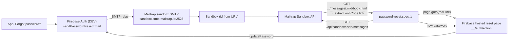

# Mailtrap Email Sandbox — auth-email capture for browser E2E

One runbook for *why* and *how* the workspace uses a Mailtrap sandbox to
automate Firebase auth-email flows in browser E2E.

| | |
|---|---|
| Scope | Test infrastructure only — never production traffic |
| Consumers | `starter-mobile/e2e/password-reset.spec.ts` via `starter-mobile/e2e/mailtrap.ts` |
| Status | ✅ Active on DEV (relay + API token wired). Spec is **manual-run only — excluded from the PR gate** (Firebase auth-email quota) |

---

## Why

Firebase owns the auth emails: `sendPasswordResetEmail`, `sendEmailVerification`,
etc. run entirely inside Firebase — the app code never sees the email, the
reset link, or the one-time code (`oobCode`). That makes the forgot-password
flow the one auth journey a pure UI test cannot complete: clicking "Forgot
password?" only proves the send was *requested*, not that a real, working
reset email exists.

A Mailtrap **sandbox** closes that gap with two halves:

1. **SMTP relay capture** — the DEV Firebase project relays its auth emails
   through the sandbox SMTP server, so every reset/verification email Firebase
   sends lands in a sandbox inbox (sandboxes accept mail to any recipient).
2. **API read-back** — the E2E reads that inbox via the Mailtrap API, finds the
   message addressed to the throwaway test user, extracts the real
   `https://…/__/auth/action?mode=resetPassword&oobCode=…` URL from the email
   body, opens it in the browser, and completes the reset on Firebase's own
   hosted page.

Nothing is mocked or bypassed: the spec exercises the identical email and
landing page a real user would.



## Anatomy: the four credentials

Mailtrap sandbox has **two independent credential pairs** — confusing them is
the most common setup failure.

| Purpose | Credential | Example (this workspace) | Used by |
|---|---|---|---|
| **Send** (Firebase → Mailtrap) | SMTP host/port/user/password | `sandbox.smtp.mailtrap.io:2525`, `92aa37dd19b4c9` / `c36c6983d50ee6` | Firebase console SMTP relay |
| **Read** (E2E → Mailtrap) | API token + inbox id | `MAILTRAP_API_TOKEN`, `MAILTRAP_INBOX_ID` | `e2e/mailtrap.ts` |

The SMTP credentials **cannot** read the inbox (the API rejects them with
`401 Incorrect API token`) and the API token is **not** a SMTP password. They
live in different places in the Mailtrap UI.

### The read token is permission-scoped

Mailtrap API tokens authenticate fine but only reach what their *permissions*
allow (resource types: `account`, `project`, `sandbox`, `domain`; access level
10 = viewer, 100 = admin). To read messages, the token needs **Sandbox**
(Email Testing) access on the inbox/sandbox. A token created purely for
sending (domain permission) replies to the testing endpoints with
`{"errors":"Endpoint is not supported for API tokens"}` — the exact symptom
hit during activation. Granting viewer on the sandbox is enough for `GET
messages`; admin is not required.

You can **edit an existing token's permissions without regenerating the token
value**: mailtrap.io/settings/api-tokens → the token's ⋯ menu → **Edit
permissions** → check the Sandbox/Email Testing rows → Save. No new
`MAILTRAP_API_TOKEN` is needed.

## Activation (one-time, per app DEV environment)

### 1. Point DEV Firebase auth email at the sandbox

Console-only — there is no CLI or Admin SDK API for the SMTP relay.

1. Firebase Console → your DEV project → **Authentication → Email templates**.
2. Scroll to the **SMTP relay** section → enable custom SMTP.
3. Fill:
   - SMTP host: `sandbox.smtp.mailtrap.io`
   - Port: `2525`
   - Username: sandbox user (`92aa37dd19b4c9`)
   - Password: sandbox password (`c36c6983d50ee6`)
4. Use the console's **"Send test email"** button and confirm the message
   appears in the Mailtrap inbox.

Do this for **DEV only** — production must keep Firebase's normal delivery. A
production app relaying real users' reset emails into a test inbox is a
security incident.

### 2. Create the read credential

1. Mailtrap → **Settings → API Tokens**. Create a token (or edit an existing
   one) and make sure it has **Sandbox / Email Testing** permission — a token
   scoped only to sending/domains cannot read messages.
2. The **sandbox id** is the number in the sandbox URL
   (`https://mailtrap.io/sandboxes/<SANDBOX_ID>/settings`). That is the
   `MAILTRAP_INBOX_ID` value (the name predates the v2 API; it is a sandbox id,
   not an inbound-inbox id).
3. Export locally:
   ```bash
   export MAILTRAP_API_TOKEN=<token>
   export MAILTRAP_INBOX_ID=<sandbox-id>
   npx playwright test --project=chromium e2e/password-reset.spec.ts
   ```

Quick sanity check of the token (Sandbox API v2, `Api-Token` header):

```bash
curl -s -H "Api-Token: $MAILTRAP_API_TOKEN" \
  "https://mailtrap.io/api/sandboxes/$MAILTRAP_INBOX_ID/messages"
```

A JSON array (even `[]`) means the token + sandbox are wired correctly.
Message bodies are separate:
`GET /api/sandboxes/{id}/messages/{message_id}/body.html` (Bearer is also
accepted, but the documented primary header is `Api-Token`).

> **Do not use the legacy v1 route** (`/api/v1/inboxes/…`) — it answers
> `{"errors":"Endpoint is not supported for API tokens"}` for current tokens,
> and `/api/inbound/…` is a different product (Inbound mail) and answers
> `Not Found` for sandbox ids.

## CI wiring — manual-run only (by design)

The password-reset spec is **deliberately NOT in the PR gate**. The CI job
(`starter-mobile/.github/workflows/web-e2e.yml`) does not receive
`MAILTRAP_*` env. Reasons:

- It depends on the DEV Firebase SMTP relay (console config, DEV project).
- Every run burns Firebase's auth-email quota. Spark (free) limits password
  reset emails to **150/day** and address-verification emails to 1000/day
  ([Firebase Authentication limits](https://firebase.google.com/docs/auth/limits?hl=en)).
  A PR gate would exhaust the shared DEV quota and make the whole suite flaky
  (Firebase returns success while silently throttling — the app shows
  "sent", but no email arrives).

Run it on demand with the two env vars exported (or set in the gitignored
`.env`, which Playwright loads via dotenv):

```bash
cd starter-mobile
export MAILTRAP_API_TOKEN=<token>   # or set in .env
export MAILTRAP_INBOX_ID=4884176
npx playwright test --project=chromium e2e/password-reset.spec.ts
```

The spec **skips cleanly when either is absent** (same pattern as
`ai.spec.ts` skipping without `E2E_VERIFIED_EMAIL`), so CI is never blocked by
missing wiring.

Quota-aware operation: one run uses ~2 auth emails (1 signup verification
+ 1 reset). On Spark, budget ~70 runs/day; if the reset email stops arriving,
the quota is exhausted — wait for the daily reset (midnight PST) or move the
DEV project to Blaze (10,000 reset emails/day) for unrestricted testing.

## How the E2E consumes it

- `starter-mobile/e2e/mailtrap.ts` — polls
  `GET /api/sandboxes/{id}/messages` (Sandbox API v2, `Api-Token` header) until
  a message addressed to the throwaway `e2e-smoke+<id>@starter-demo-dev.com`
  arrives (default 120 s), fetches that message's
  `…/messages/{message_id}/body.html`, HTML-unescapes it, and returns the first
  `mode=resetPassword&oobCode=` action URL.
- `starter-mobile/e2e/password-reset.spec.ts` — signs out, requests the reset
  through the app UI, waits for the real email, opens the real link, stores the
  new password on Firebase's hosted page, then signs in with the **new**
  password and asserts the **old** one is refused.

## Security rules

- The API token is a secret: never commit it, never put it in
  `EXPO_PUBLIC_*`, never log it.
- Sandbox only. Production Firebase must never relay through Mailtrap.
- Match read-back on the unique throwaway address so concurrent runs (or the
  console test email) never satisfy the wrong spec.
- The inbox can be emptied between runs; a busy inbox only slows the poll.

## Troubleshooting

| Symptom | Likely cause |
|---|---|
| Spec times out waiting for the email | Relay not configured (console step 1), wrong sandbox id/token, or the message went to a different sandbox |
| `401 {"error":"Incorrect API token"}` | Using the SMTP password as the API token — read vs. send credentials (see Anatomy) |
| `{"errors":"Endpoint is not supported for API tokens"}` (v1 URL) | Legacy v1 route — use the Sandbox v2 routes `/api/sandboxes/…` with the `Api-Token` header (see §2) |
| `{"error":"Not Found"}` (`/api/inbound/…`) | Inbound is a different product — use `/api/sandboxes/{id}/messages`, where `{id}` is the SANDBOX id from `mailtrap.io/sandboxes/<id>/settings` |
| `403` on `/api/sandboxes/…` | Token lacks **Sandbox/Email Testing permission** — edit the token's permissions and grant Sandbox access (no new token needed) |
| Console "Send test email" fails | SMTP host/port/user/pass wrong, or the sandbox SMTP port is blocked from the console's network (rare) |
| Email arrives but no link found | Message body lacks a `resetPassword` `oobCode` (e.g. a verification email was matched) |