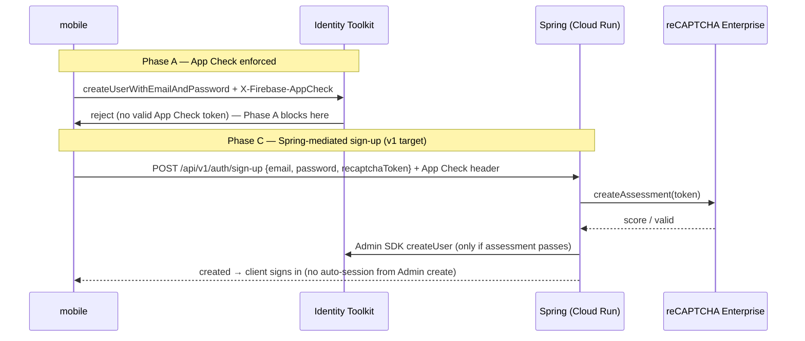

# SIGNUP_ABUSE_GATE.md — Sign-up abuse gate (per Product App)

**Status: A + C implemented in code; activation (console + builds) per-app.** Per-uid AI quotas
are the strongest abuse control in this architecture — but only as strong as account creation
being hard to automate. Sign-up is client-direct on native (mobile → Firebase, Spring never sees
it) and Spring-mediated on web, so an attacker minting free uids rotates past every quota unless
A is enforced.

**The one architectural fact that shapes everything:** a `beforeUserCreated` blocking function
**cannot** run a reCAPTCHA Enterprise assessment — the event carries no client token channel, and
the `recaptchaScore`/`recaptchaActionOverride` API exists only on `beforeSmsSent` (phone-auth bot
detection). "reCAPTCHA Enterprise / blocking functions" is therefore **three separable
mechanisms**, composed in phases. Verified against live Firebase/Google docs; re-verify numbers
at activation.

## The three mechanisms

| Phase | Mechanism | Stops | Needs | Code | Cost |
|---|---|---|---|---|---|
| **A** | App Check enforcement on Identity Platform (console toggle) | Raw scripts/curl minting accounts via Identity Toolkit REST | Native App Check wired first (else native sign-in breaks) | None | Free |
| **C** | reCAPTCHA Enterprise assessment on a **Spring-mediated sign-up** | Human-farming + everything A stops, scored per attempt | New contract endpoint + assessment adapter | Backend + mobile + `openapi.yaml` | Shared 10k assessments/mo org pool |
| **B** | `beforeUserCreated` blocking function | Velocity/IP/disposable-email heuristics at uid-mint time | Identity Platform upgrade + Blaze + first Cloud Functions deploy | New Node runtime (`functions/`) | MAU pricing; verify tier |

Order of work: **A → C; B only on evidence** (uid-mint velocity shows up in abuse metrics). Phase
0 regardless: disable anonymous auth (console-only, [FIREBASE_AUTH.md](./FIREBASE_AUTH.md)).

## Phase A — App Check enforcement on Identity Platform (console-only)

The App Check console can enforce on **Identity Platform itself**: sign-up, sign-in, password
reset requests without a valid App Check token are rejected at `identitytoolkit.googleapis.com`.
This makes scripted account creation materially harder with zero code — the App Check web
provider already ships ([APP_CHECK.md](./APP_CHECK.md)).

Prerequisites, in order:

1. **Native App Check — wired in code** (2026: `@react-native-firebase/app-check` + Expo config
   plugins behind `EXPO_PUBLIC_APP_CHECK_ENABLED`; see
   [APP_CHECK.md](./APP_CHECK.md#native-mobile-iosandroid--wired-in-code-activation-per-app)).
   `eas.json` now bakes `EXPO_PUBLIC_APP_CHECK_ENABLED=true` into the `preview` (smoke) and
   `production` profiles — EAS builds do not inherit shell env, so a profile without it would
   silently build with App Check off and the first PROD enforcement flip would break native auth.
   Native sent no token before this — enforcement would have broken native sign-in.
2. App Check registered in both DEV and PROD projects (web + native providers) — console steps in
   [APP_CHECK.md §Console provisioning](./APP_CHECK.md#console-provisioning-per-environment-project--user-action).
3. Live smoke passes with enforcement OFF (monitor mode), then flip.

### Activation checklist (per environment project; console + builds are user actions)

1. **Console files**: place `google-services.json` / `GoogleService-Info.plist` (gitignored) at
   the mobile repo root — downloads from Firebase console after registering the Android
   (package id + SHA-256) and iOS (bundle id) apps.
2. **Register App Check apps** (per project): Android → Play Integrity; iOS → App Attest +
   DeviceCheck fallback; Web → reCAPTCHA Enterprise v3 site key (same key the assessment uses).
3. **EAS preview build** (Android first — no Apple credentials needed):
   `eas build --profile preview --platform android`. `APP_ENV=development` in that profile selects
   the **debug** providers. First launch prints the debug token to logcat
   (`adb logcat | grep -i appcheck`) / Xcode console — register it under
   **App Check → Apps → Manage debug tokens** (or pin it up front via
   `eas secret:create --name EXPO_PUBLIC_APP_CHECK_DEBUG_TOKEN --value <token>`).
4. **Native smoke** (monitor mode, enforcement OFF): install the preview build on a real device,
   sign in with a test user → the Identity Toolkit call carries a valid token → the backend
   (App Check ON in DEV) accepts a required-token route. Success = the JS-SDK bridge works; this
   is the hard gate for the flip.
5. **Flip, DEV first**: **Build → App Check → Enforcement → Identity Platform → Enforced**
   (existence verified; exact wording may differ). Then verify scripted rejection:
   `curl -X POST 'https://identitytoolkit.googleapis.com/v1/accounts:signUp?key=<DEV apiKey>' -H 'Content-Type: application/json' -d '{"email":"a@b.co","password":"secret123"}'`
   → must now fail with an App Check error (it succeeded before the flip).
6. **Post-flip smoke**: repeat 4 (sign-in, sign-up via web, password reset) on preview build +
   web bundle → then repeat 3–6 for the PROD project with a `production` build (real providers:
   Play Integrity / App Attest — no debug tokens).
7. **Rollback** = same toggle back to Off/monitor — takes seconds, no deploy involved. Keep old
   installed clients in mind: any binary built before the App Check env landed sends no token and
   **breaks at the flip** — this is a force-upgrade window, not a graceful deprecation.

Console click-path (verify exact wording at activation — existence of the toggle is verified, the
click-path wording is inferred): **Build → App Check → Enforcement → Identity Platform →
Enforced**. Per [Google's doc](https://cloud.google.com/identity-platform/docs/admin/app-check-integration)
enable App Check for the project first.

Caveats:

- Web App Check (reCAPTCHA Enterprise) is bypassable by headless clients — Phase A raises the bar
  for casual scripters; it is not a full stop.
- **The JS-SDK auth trap**: on this template, auth runs on the Firebase JS SDK, which attaches App
  Check tokens to Identity Toolkit calls only from a JS-layer App Check instance. The native
  adapter ships the bridge (`CustomProvider` -> RNFB `getToken`) so enforcement does not break
  native auth — this is exactly why the native live smoke is a hard prerequisite for the flip.
- Keep Cloud Run's own App Check verification untouched: console enforcement governs Firebase
  services only, this Spring API remains its own enforcement point.

## Phase C — Spring-mediated sign-up (v1 target)

Move sign-up through the API so the assessment happens before a uid exists. Fits the port +
adapter house pattern exactly (port + `RestClient` adapter + fail-closed config + `local` mock —
same shape as `EmailPort`).

Status: **backend implemented** (2026-09: route in the contract, gate default-off); **mobile
adoption implemented for web** (native deliberately stays client-direct — see below).

- ✅ **Contract**: `POST /api/v1/auth/sign-up` in `starter-backend/openapi.yaml`
  `{email, password, recaptchaToken?}` → `201 {uid}`; `403 RECAPTCHA_INVALID`, `409 EMAIL_EXISTS`,
  `502 RECAPTCHA_PROVIDER_ERROR`. Mobile pins the re-pinned digest (`c19e8a1a…`).
- ✅ **Backend**: `RecaptchaConfig` (`starter.recaptcha.*`, fail-closed) → `RecaptchaAssessorPort`
  → `RecaptchaEnterpriseAdapter` (`RestClient`, API-key auth, timeouts) + `MockRecaptchaAssessor`
  (local). Policy in `SignUpService`: blank token / failed verdict / wrong action / score below
  `starter.recaptcha.min-score` → `403 RECAPTCHA_INVALID`; assessor outage → `502` and **no
  account minted**. App Check **required** on the route when enabled (`AppCheckFilter`).
- ✅ **Backend**: account creation via Admin SDK `createUser` (`AccountCreatorPort`, implemented
  by `FirebaseAuthServiceImpl`; `MockAccountCreator` under `local`). Passwords and tokens never
  logged. Env: `RECAPTCHA_ENABLED`, `RECAPTCHA_PROJECT_ID`, `RECAPTCHA_SITE_KEY`,
  `RECAPTCHA_API_KEY` (Secret Manager), `RECAPTCHA_EXPECTED_ACTION`, `RECAPTCHA_MIN_SCORE`.
- ✅ **Prereq (incident 2026-09-04)**: the backend runtime SA (`starter-api@…`) needs
  `roles/firebaseauth.admin` or Admin-SDK `createUser` returns `ACCOUNT_PROVIDER_ERROR` (502)
  and every sign-up fails. Was missing in DEV → sign-ups red → e2e register red. Granted
  manually; codified in `starter-backend/infra/main.tf` (`api_runtime` roles).
- ✅ **Mobile adoption (web)**: `AuthProvider.signUp` on web = mint reCAPTCHA Enterprise token
  (`RecaptchaEnterpriseWebToken` — lazy script load, best-effort: mint failure still calls the
  route, the backend owns the policy) → `POST /api/v1/auth/sign-up` (`authenticated: false`;
  App Check header attached when available) → `signIn` (Admin SDK `createUser` creates no
  session). Gate errors surface via the standard envelope (`403 RECAPTCHA_INVALID`,
  `409 EMAIL_EXISTS`, `502 RECAPTCHA_PROVIDER_ERROR`). `HttpApiClient` now attaches the App Check
  header on **unauthenticated** requests too — the route requires it when App Check is enabled.
  Deploy sequencing: web sign-up needs a backend built after `cee2e43`; older DEV backends 404.
- ⬜ **Native stays client-direct (decision)**: native is protected by Phase A (App Check
  enforcement on Identity Platform) and has no reCAPTCHA assessment SDK — routing native through
  the API would only produce a blank token the gate rejects. Revisit only if a product needs
  per-attempt scoring on native.
- ✅ **Email verification** stays Firebase-native and unaffected.

Estimate ~1 day of code — the plan's number applies to this phase, not to the whole gate.

Caveats:

- Assessments share the **org-wide 10k/month free pool with App Check web token minting**
  ([billing](https://cloud.google.com/recaptcha/docs/billing-information)). Essentials (no
  billing attached) hard-stops with `429` beyond 10k; Premium (billing on): free ≤10k, $8 flat
  ≤100k, then $0.001/assessment.
- Two round trips (create → sign-in) replace the client-direct one; acceptable.
- C′ alternative (only if keeping client-direct sign-up is a hard requirement): Spring pre-gate
  mints a one-time challenge stored in Firestore, and a `beforeUserCreated` function consumes it
  — but that drags in Phase B's Cloud Functions surface; not the v1 path.

## Phase B — Blocking function (only on evidence)

`beforeUserCreated` (`firebase-functions/v2/identity`, Node) can inspect `userRecord`,
`additionalUserInfo`, and `context` (ipAddress/userAgent) — heuristics only: disposable-email
domains, per-IP mint velocity (needs a counter store), admin-allowlist.

Costs/requirements — deliberately heavy for a template:

- **Identity Platform upgrade** (blocking functions require it) + **Blaze plan** (Cloud Functions
  deployment) — verify MAU free tier at activation.
- First `functions/` runtime in a Java-only workspace: new deploy workflow step, new dependency
  audit, new runtime to keep patched.

Not worth it until abuse metrics show uid-mint velocity that A + C don't stop.

## Verification (per phase, per environment)

- **A**: App Check monitor mode shows Identity Platform traffic; flip to enforced; native +
  web smoke: sign-up/sign-in/reset on real builds; scripted `accounts:signUp` REST call →
  rejected.
- **C**: backend integration test with a mock `RecaptchaPort` (invalid → 403, low score → 403,
  valid → created); `MockAppCheckVerifier` path for local; browser E2E reuses the App Check
  token-minting harness; contract digest re-pinned (`npm run validate:contract`).
- **B**: function unit tests + staged rollout in DEV project before PROD.

## Rules that must not be broken

- **Native App Check must ship before any Phase A enforcement flip** — enforcement breaks native
  sign-in otherwise.
- Never log the password or the reCAPTCHA token; treat assessment tokens like App Check tokens.
- Assessment failure blocks the **new sign-up route only** — never gate sign-in of existing users
  on reCAPTCHA.
- The App Check "auxiliary signal, never authentication" rule stands for Cloud Run routes; console
  enforcement on Identity Platform is the one place App Check becomes a hard gate, and it applies
  to Firebase Auth only.
- Flip enforcement via the console + runbook, never by hand-editing service config; do every
  flip in DEV first, after a live smoke.
- Keep the 10k/mo org-wide assessment pool in mind when adding assessment-bearing routes.

## What is shared vs per-app

reCAPTCHA Enterprise site keys, App Check registrations, and enforcement state: per app, per
environment (DEV/PROD projects), same as App Check — see
[guides/STEP6_NEW_APP_FROM_STARTER.md](../guides/STEP6_NEW_APP_FROM_STARTER.md) §2.