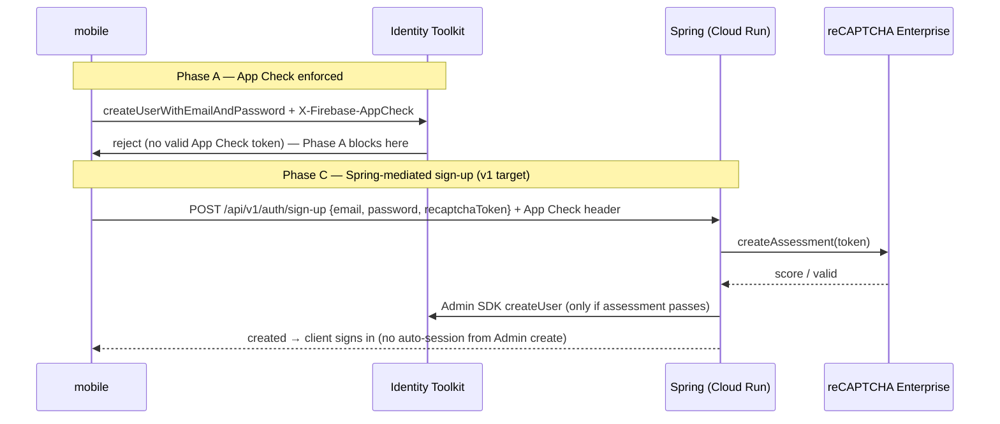

# SIGNUP_ABUSE_GATE.md — Sign-up abuse gate (per Product App)

**Status: plan + runbook ready; no code yet.** Per-uid AI quotas are the strongest abuse control
in this architecture — but only as strong as account creation being hard to automate. Sign-up is
client-direct today (mobile → Firebase, Spring never sees it), so an attacker mints free uids and
rotates past every quota.

**The one architectural fact that shapes everything:** a `beforeUserCreated` blocking function
**cannot** run a reCAPTCHA Enterprise assessment — the event carries no client token channel, and
the `recaptchaScore`/`recaptchaActionOverride` API exists only on `beforeSmsSent` (phone-auth bot
detection). "reCAPTCHA Enterprise / blocking functions" is therefore **three separable
mechanisms**, composed in phases. Verified against live Firebase/Google docs; re-verify numbers
at activation.

## The three mechanisms

| Phase | Mechanism | Stops | Needs | Code | Cost |
|---|---|---|---|---|---|
| **A** | App Check enforcement on Identity Platform (console toggle) | Raw scripts/curl minting accounts via Identity Toolkit REST | Native App Check wired first (else native sign-in breaks) | None | Free |
| **C** | reCAPTCHA Enterprise assessment on a **Spring-mediated sign-up** | Human-farming + everything A stops, scored per attempt | New contract endpoint + assessment adapter | Backend + mobile + `openapi.yaml` | Shared 10k assessments/mo org pool |
| **B** | `beforeUserCreated` blocking function | Velocity/IP/disposable-email heuristics at uid-mint time | Identity Platform upgrade + Blaze + first Cloud Functions deploy | New Node runtime (`functions/`) | MAU pricing; verify tier |

Order of work: **A → C; B only on evidence** (uid-mint velocity shows up in abuse metrics). Phase
0 regardless: disable anonymous auth (console-only, [FIREBASE_AUTH.md](./FIREBASE_AUTH.md)).

## Phase A — App Check enforcement on Identity Platform (console-only)

The App Check console can enforce on **Identity Platform itself**: sign-up, sign-in, password
reset requests without a valid App Check token are rejected at `identitytoolkit.googleapis.com`.
This makes scripted account creation materially harder with zero code — the App Check web
provider already ships ([APP_CHECK.md](./APP_CHECK.md)).

Prerequisites, in order:

1. **Native App Check — wired in code** (2026: `@react-native-firebase/app-check` + Expo config
   plugins behind `EXPO_PUBLIC_APP_CHECK_ENABLED`; see
   [APP_CHECK.md](./APP_CHECK.md#native-mobile-iosandroid--wired-in-code-activation-per-app)).
   Remaining activation: console app registrations (Play Integrity + SHA-256 / App Attest +
   DeviceCheck), the gitignored console files at the mobile repo root, and an EAS build + live
   smoke. Native sent no token before this — enforcement would have broken native sign-in.
2. App Check registered in both DEV and PROD projects (web + native providers).
3. Live smoke passes with enforcement OFF (monitor mode), then flip.

Console click-path (verify exact wording at activation — existence of the toggle is verified, the
click-path wording is inferred): **Build → App Check → Enforcement → Identity Platform →
Enforced**. Per [Google's doc](https://cloud.google.com/identity-platform/docs/admin/app-check-integration)
enable App Check for the project first.

Caveats:

- Web App Check (reCAPTCHA Enterprise) is bypassable by headless clients — Phase A raises the bar
  for casual scripters; it is not a full stop.
- **The JS-SDK auth trap**: on this template, auth runs on the Firebase JS SDK, which attaches App
  Check tokens to Identity Toolkit calls only from a JS-layer App Check instance. The native
  adapter ships the bridge (`CustomProvider` -> RNFB `getToken`) so enforcement does not break
  native auth — this is exactly why the native live smoke is a hard prerequisite for the flip.
- Keep Cloud Run's own App Check verification untouched: console enforcement governs Firebase
  services only, this Spring API remains its own enforcement point.

## Phase C — Spring-mediated sign-up (v1 target)

Move sign-up through the API so the assessment happens before a uid exists. Fits the port +
adapter house pattern exactly (`RecaptchaPort` + `RestClient` adapter + fail-closed config +
`local` mock — same shape as `EmailPort`).

Pieces (all ⬜):

- **Contract**: new endpoint in `starter-backend/openapi.yaml`, e.g. `POST /api/v1/auth/sign-up`
  `{email, password, recaptchaToken}` → `201`; error mapping `RECAPTCHA_INVALID` (403),
  `EMAIL_EXISTS` (409). Backend owns the contract; mobile consumes via the pinned digest.
- **Backend**: `RecaptchaPort` → `RecaptchaRestAdapter` calling
  `POST https://recaptchaenterprise.googleapis.com/v1/projects/{project}/assessments` via
  `RestClient`; check token validity, expected action, score threshold. App Check **required** on
  this route (join `AppCheckFilter`'s required list). Config `starter.recaptcha.*` (site key
  secret, action, min-score, enabled per env); fail closed when enabled.
- **Backend**: user creation via Firebase Admin SDK `createUser` after the assessment passes.
  Never log password or the reCAPTCHA token.
- **Mobile**: `AuthPort.signUp` gains the token: mint a reCAPTCHA Enterprise token (same site key
  as App Check: `EXPO_PUBLIC_RECAPTCHA_ENTERPRISE_SITE_KEY`), call the API, then sign in via
  Firebase (Admin SDK creates no session — no auto-sign-in like `createUserWithEmailAndPassword`).
- **Email verification** stays Firebase-native and unaffected.

Estimate ~1 day of code — the plan's number applies to this phase, not to the whole gate.

Caveats:

- Assessments share the **org-wide 10k/month free pool with App Check web token minting**
  ([billing](https://cloud.google.com/recaptcha/docs/billing-information)). Essentials (no
  billing attached) hard-stops with `429` beyond 10k; Premium (billing on): free ≤10k, $8 flat
  ≤100k, then $0.001/assessment.
- Two round trips (create → sign-in) replace the client-direct one; acceptable.
- C′ alternative (only if keeping client-direct sign-up is a hard requirement): Spring pre-gate
  mints a one-time challenge stored in Firestore, and a `beforeUserCreated` function consumes it
  — but that drags in Phase B's Cloud Functions surface; not the v1 path.

## Phase B — Blocking function (only on evidence)

`beforeUserCreated` (`firebase-functions/v2/identity`, Node) can inspect `userRecord`,
`additionalUserInfo`, and `context` (ipAddress/userAgent) — heuristics only: disposable-email
domains, per-IP mint velocity (needs a counter store), admin-allowlist.

Costs/requirements — deliberately heavy for a template:

- **Identity Platform upgrade** (blocking functions require it) + **Blaze plan** (Cloud Functions
  deployment) — verify MAU free tier at activation.
- First `functions/` runtime in a Java-only workspace: new deploy workflow step, new dependency
  audit, new runtime to keep patched.

Not worth it until abuse metrics show uid-mint velocity that A + C don't stop.

## Verification (per phase, per environment)

- **A**: App Check monitor mode shows Identity Platform traffic; flip to enforced; native +
  web smoke: sign-up/sign-in/reset on real builds; scripted `accounts:signUp` REST call →
  rejected.
- **C**: backend integration test with a mock `RecaptchaPort` (invalid → 403, low score → 403,
  valid → created); `MockAppCheckVerifier` path for local; browser E2E reuses the App Check
  token-minting harness; contract digest re-pinned (`npm run validate:contract`).
- **B**: function unit tests + staged rollout in DEV project before PROD.

## Rules that must not be broken

- **Native App Check must ship before any Phase A enforcement flip** — enforcement breaks native
  sign-in otherwise.
- Never log the password or the reCAPTCHA token; treat assessment tokens like App Check tokens.
- Assessment failure blocks the **new sign-up route only** — never gate sign-in of existing users
  on reCAPTCHA.
- The App Check "auxiliary signal, never authentication" rule stands for Cloud Run routes; console
  enforcement on Identity Platform is the one place App Check becomes a hard gate, and it applies
  to Firebase Auth only.
- Flip enforcement via the console + runbook, never by hand-editing service config; do every
  flip in DEV first, after a live smoke.
- Keep the 10k/mo org-wide assessment pool in mind when adding assessment-bearing routes.

## What is shared vs per-app

reCAPTCHA Enterprise site keys, App Check registrations, and enforcement state: per app, per
environment (DEV/PROD projects), same as App Check — see
[guides/STEP6_NEW_APP_FROM_STARTER.md](../guides/STEP6_NEW_APP_FROM_STARTER.md) §2.