# Backend CI/CD and Deployment

## Goal

Every production revision is an approved promotion of the exact immutable container digest that passed CI and DEV smoke tests. GitHub authenticates to Google Cloud with short-lived OIDC credentials; no service-account JSON key is stored in GitHub.

This document describes the target independent backend repository. The parent-workspace workflows are prototype-only.

## Pipeline

```mermaid
flowchart LR
  PR["Pull request"] --> Verify["mvn verify + contract + scans"]
  Verify --> Merge["Merge to main"]
  Merge --> Build["Build container once"]
  Build --> Digest["Push and record sha256 digest"]
  Digest --> Dev["Deploy digest to DEV"]
  Dev --> Smoke["DEV smoke/contract checks"]
  Smoke --> Approval["Protected production approval"]
  Approval --> Prod["Deploy same digest to PROD"]
  Prod --> ProdSmoke["PROD smoke check"]
```



## Repository workflows

```text
.github/workflows/
├── ci.yml
├── deploy-dev.yml
├── promote-prod.yml
├── infra-plan.yml
└── infra-apply.yml
```

### `ci.yml`

Trigger: every pull request and push to `main`.

Required checks:

1. Use the pinned Java distribution/version.
2. `./mvnw verify -B`.
3. Validate `openapi/openapi.yaml` and implementation compatibility.
4. Dependency/license policy and secret scan.
5. Build the Docker image and start it with safe test configuration.
6. Assert liveness and fail-closed profile behavior.

The branch is protected so a PR cannot merge unless required checks pass.

### `deploy-dev.yml`

Trigger: push to protected `main`, or a reusable workflow called only after verification. Jobs in the workflow have explicit dependencies:

```text
verify -> build-and-push -> deploy-dev -> smoke-dev
```

Requirements:

- Build exactly once from the checked-out commit.
- Push an immutable commit tag and capture the registry digest.
- Generate SBOM/provenance and apply the vulnerability policy.
- Deploy `IMAGE_URI@sha256:DIGEST`, not `:latest` or a mutable tag.
- Record commit, digest, Cloud Run revision, workflow run, and timestamp.
- Mark the digest eligible for production only after smoke tests pass.

Use a DEV concurrency group with cancellation so an older queued deployment cannot replace a newer one.

### `promote-prod.yml`

Trigger: manual workflow with an eligible digest/release identifier.

Requirements:

- Use the protected `production` GitHub environment.
- Require approval and disallow self-approval where supported.
- Authenticate with a PROD-specific WIF principal.
- Verify the digest exists, was produced by this repository, and passed DEV.
- Do not check out/build application source.
- Deploy the exact digest and record the production revision.
- Run minimal non-destructive smoke checks.
- Leave the previous healthy revision available for rollback.

GitHub environments can hold protected configuration/secrets and approval rules; see [GitHub's deployment environments documentation](https://docs.github.com/en/actions/reference/workflows-and-actions/deployments-and-environments).

## Artifact Registry design

Recommended for stable promotion: one private Artifact Registry repository dedicated to release artifacts, accessible read-only to the DEV and PROD Cloud Run service agents. It may live in a small shared platform project or another explicitly chosen project.

Cloud Run supports deploying by exact digest and from an Artifact Registry repository in another project when the deployer and Cloud Run service agent have the required access. See [Deploy container images to Cloud Run](https://docs.cloud.google.com/run/docs/deploying).

If the organization forbids a shared registry, copy the tested digest into the PROD registry without rebuilding and verify the destination digest matches. Document and automate the copy; source recompilation is not promotion.

## Authentication and permissions

Use GitHub Actions OIDC to Google Workload Identity Federation. Restrict the provider condition to the exact repository and expected branch/environment. GitHub documents the short-lived-token pattern in [Configuring OpenID Connect in Google Cloud](https://docs.github.com/en/actions/how-tos/secure-your-work/security-harden-deployments/oidc-in-google-cloud-platform).

Separate identities:

| Identity | Minimum purpose |
|---|---|
| CI | Read source/dependencies; no cloud deploy |
| DEV builder/publisher | Push release image and attestations |
| DEV deployer | Deploy DEV service and read selected secrets/config |
| PROD deployer | Deploy an approved digest to PROD only |
| Runtime DEV/PROD | Access only environment-owned data and runtime secrets |

Avoid project-wide Owner/Editor roles. Grant IAM at the repository, service, secret, or database scope where practical.

## Environment configuration

GitHub environment variables hold non-secret values:

- `GCP_PROJECT_ID`
- `GCP_REGION`
- `CLOUD_RUN_SERVICE`
- `ARTIFACT_IMAGE`
- runtime service account email

Secret Manager holds runtime secrets. GitHub passes Secret Manager references to Cloud Run; it does not read provider keys into build logs.

## Cloud Run baseline

Start small and tune from measurements:

| Setting | DEV | PROD |
|---|---|---|
| Min instances | `0` | `0` initially; raise only for latency SLO |
| Max instances | low cost cap | explicit cost/capacity cap |
| Concurrency | load-tested value | load-tested value |
| CPU/memory | smallest passing load test | based on load test |
| Startup probe | liveness | liveness |
| Deployment check | readiness + API smoke | readiness + non-destructive smoke |

Do not copy fixed CPU, memory, or max-instance numbers to every app without a load/cost decision.

## Database changes

Firestore is schema-flexible, but data changes can still break releases. Any migration/backfill must be:

- backward-compatible with the currently deployed mobile/backend;
- idempotent and resumable;
- separately observable and rate-limited;
- deployed before code that requires the new data;
- documented with rollback/forward-fix behavior.

## Release metadata

Store for each deployment:

```text
git commit
container digest
SBOM/provenance reference
OpenAPI contract version
Cloud Run revision
target environment
workflow run URL
approver and timestamp
smoke-test result
```

## Rollback

Primary rollback: route traffic to the last known-good Cloud Run revision. Secondary rollback: redeploy the last known-good digest.

Rollback does not reverse data changes. Prefer backward-compatible changes and forward fixes; document any exceptional data recovery procedure before deploying the change.

Perform a rollback drill before template v1 and periodically for each product.

## Acceptance criteria

- [ ] A failed verification prevents image publication and deployment
- [ ] DEV displays the same digest recorded by CI
- [ ] PROD workflow has no build step
- [ ] PROD deployment requires protected-environment approval
- [ ] Long-lived GCP keys are absent from GitHub
- [ ] Runtime identities cannot access the other environment
- [ ] Post-deploy smoke failure is visible and has a documented rollback action
- [ ] A rollback drill has succeeded
