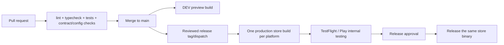

# Mobile CI/CD and Release

## Goal

Keep development feedback fast while ensuring the binary released to users is the same store-signed artifact tested through App Store/Play testing. The mobile repository owns its workflows and store credentials independently of the backend repository.

## Artifact types

| Artifact | EAS profile | Config | Purpose | Store-promotable |
|---|---|---|---|---|
| Development client | `development` | DEV/local | Developer tooling | No |
| Preview/internal build | `preview` | DEV | Fast stakeholder QA | No |
| Store release candidate | `production` | PROD | TestFlight/Play testing, then release | Yes |

Expo documents that internal preview builds differ from production builds in signing/packaging, while production builds are used for store release or store-managed testing. See [Configure EAS Build with eas.json](https://docs.expo.dev/build/eas-json/) and [distribution overview](https://docs.expo.dev/distribution/introduction/).

## Pipeline



## Repository workflows

```text
.github/workflows/
├── ci.yml
├── build-preview.yml
├── build-release.yml
├── submit-release.yml
└── publish-update.yml       # optional
```

### `ci.yml`

Trigger: pull requests and pushes to `main`.

Required checks:

1. Pin Node and use `npm ci`.
2. `npm run lint`.
3. `npx tsc --noEmit`.
4. Unit/component tests.
5. Expo Doctor or equivalent compatibility check.
6. Validate the pinned backend contract/generated types.
7. Evaluate build configuration for DEV and PROD with non-secret fixtures; assert mixed/missing values fail.

### `build-preview.yml`

Trigger: merge to `main` or manual dispatch.

- Uses EAS `preview` and the DEV EAS environment.
- Produces internal-distribution artifacts for QA.
- Records commit and EAS build IDs.
- Never submits to public store release.

Use concurrency/cancellation to avoid paying for stale queued preview builds when appropriate.

### `build-release.yml`

Trigger: protected release tag or manual dispatch from a reviewed commit.

- Uses EAS `production` and the production EAS environment.
- Fails if API URL/Firebase project/app IDs are not production values.
- Creates store-signed iOS and Android artifacts once.
- Records commit, EAS build IDs, versions/build numbers, contract version, and runtime version.

### `submit-release.yml`

Trigger: manual, using the recorded production build IDs.

- Uses a protected GitHub production environment.
- Uploads the existing store artifacts; it does not rebuild.
- Starts in TestFlight/internal testing and Play internal testing.
- Public/phased release occurs only after device validation and approval.

EAS Submit uploads a binary but store release status is still controlled by App Store Connect/Play Console policies.

## EAS configuration principles

Keep `eas.json` free of real environment values when possible. Select named EAS environments and validate them in `app.config.ts`.

Conceptual profiles:

```json
{
  "build": {
    "development": {
      "developmentClient": true,
      "distribution": "internal",
      "environment": "development"
    },
    "preview": {
      "distribution": "internal",
      "environment": "preview"
    },
    "production": {
      "distribution": "store",
      "environment": "production",
      "autoIncrement": true
    }
  }
}
```

Use the exact schema supported by the pinned EAS CLI; the example expresses policy rather than a copy-paste guarantee.

## Backend coordination

Independent releases require compatibility discipline:

- Mobile declares the backend contract version it supports.
- Backend maintains compatibility with the currently released store app.
- Breaking backend changes use a new API version and coexist through the mobile adoption window.
- A mobile production candidate points at PROD configuration. Deploy compatible backend PROD before final device validation, using backward-compatible changes.
- DEV preview validates upcoming integration against DEV but is not the production artifact.

## EAS Update

OTA updates are optional. If enabled:

- define `runtimeVersion` policy explicitly;
- separate preview and production channels/branches;
- publish only compatible JavaScript/assets to a runtime;
- protect production update publication;
- record update group/runtime/commit;
- test rollback/republish behavior;
- require a new native build for native dependency/config/plugin changes.

OTA is a release mechanism, not a way to bypass review for risky changes.

## Versioning

- Use remote app version/build-number ownership consistently.
- Tag release source after/with the release record.
- Record separate iOS/Android build IDs if one platform is rebuilt.
- Rebuilding one platform creates a new artifact that requires testing; do not reuse the other platform's approval blindly.

## Rollback

| Failure | Response |
|---|---|
| Preview regression | Build a new preview; no user impact |
| Bad production OTA | Roll back/republish last known-good compatible update |
| Bad phased store release | Halt rollout; retain compatible backend; prepare fixed build |
| Backend regression | Roll back backend digest while preserving contract compatibility |

Mobile binaries already installed on user devices cannot be instantly removed. Backend backward compatibility and server-side kill switches for dangerous optional features are therefore important.

## Acceptance criteria

- [ ] CI passes from a clean install
- [ ] Preview build contains only DEV endpoint/project identifiers
- [ ] Production build contains only PROD endpoint/project identifiers
- [ ] Preview build is never passed to store submission
- [ ] Submission uses recorded production build IDs without rebuilding
- [ ] Store candidate passes login, `/me`, AI, refresh, and sign-out on real devices
- [ ] Contract version and backend compatibility are recorded
- [ ] OTA/native rollback procedures have been exercised
